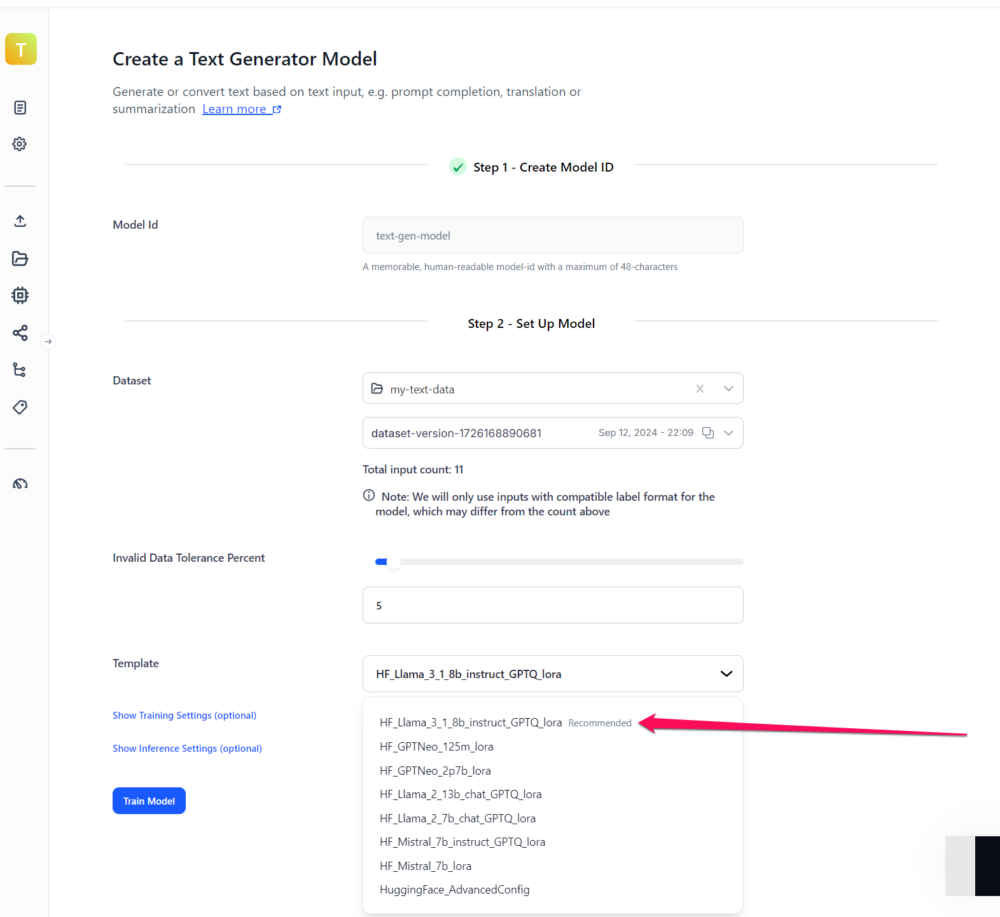
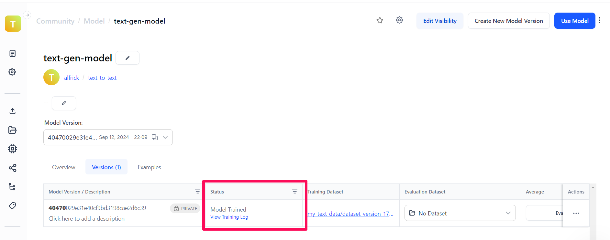

# Text Generation

**Learn about our text-to-text model type and understand its fine-tuning process**
<hr />

**Input**: Text

**Output**: Text

A text-to-text model is a type of natural language processing (NLP) model that takes a text input and generates a text output. This framework can handle a variety of tasks within the same model architecture by framing all problems as text generation problems. 

For example, it could be used for:

-	Machine translation — Translating from one language to another (e.g., English to French).
-	Summarization — Condensing a longer document into a shorter summary.
-	Text classification — Recasting classification tasks like sentiment analysis as a text generation problem.
-	Question answering — Given a question, the model generates an appropriate text answer.

Large language models (LLMs) are usually used to generate coherent and contextually appropriate text based on the instructions of the user. These foundation models, also referred to as pre-trained or base models, are massive models that have been trained on extensive amounts of data. You can use them as a starting point for text-generation tasks.

Fine-tuning allows you to adapt the foundational text-to-text models to specific tasks or domains, making them more suitable for particular applications. By training on task-specific data, you can improve model performance on those tasks.

With fine-tuning, you can take advantage of [transfer learning](https://docs.clarifai.com/portal-guide/model/model-types/transfer-learning/) and utilize the knowledge gained from a pre-trained text model to facilitate the learning process of a new model for a related problem.

:::caution Text Fine-Tuning Templates

The text-to-text model type also comes with various [templates](https://docs.clarifai.com/portal-guide/model/deep-training/text-templates) that give you the control to choose the specific architecture used by your neural network, as well as define a set of hyperparameters you can use to fine-tune the way your model learns.

::: 

You may choose a text-to-text model type in cases where:

- You need a generative model that can effectively learn patterns and structures from training data, and use this learned knowledge to generate text that is coherent and contextually relevant based on the input it receives. 
- You need a text-to-text model to learn new features not recognized by the existing Clarifai models. In that case, you may need to "deep fine-tune" your custom model and integrate it directly within your [workflows](https://docs.clarifai.com/portal-guide/workflows/).
- You have a custom-tailored dataset, accurate labels, and the expertise and time to fine-tune models.

## Fine-Tune via the UI

You can fine-tune a large language model for text generation tasks. In this example, we’ll demonstrate how to fine-tune the [LLaMA 3.1 8B Instruct](https://clarifai.com/meta/Llama-3/models/Llama-3-8B-Instruct) model for a specific use case using Clarifai's no-code platform.

You can watch the video below for a step-by-step guide.

<div style={{ "position":"relative","width": "100%","overflow": "hidden","padding-top": "56.25%"}}>
<iframe width="900" height="500" style={{"position": "absolute","top": "0","left": "0","bottom": "0","right": "0","width": "100%","height": "100%",}} src="https://www.youtube.com/embed/J2N4AbXlWZM" frameborder="0" allow="accelerometer; autoplay; encrypted-media; gyroscope; picture-in-picture" allowfullscreen ></iframe>
</div>

<br /><br />

You can also follow these steps to learn how to fine-tune a text-to-text model for generative or conversion tasks. 

### Step 1: Prepare Your Training Data

Fine-tuning a text-to-text model requires a dataset with examples in a specific format that includes both input and target sequences. The training data must be formatted according to the model's specific requirements to ensure effective learning.

For example, when preparing data for training the LLaMA 3.1 8B Instruct model, you need to follow the following format:

```text
<|begin_of_text|><|start_header_id|>system<|end_header_id|> {system_prompt}<|eot_id|><|start_header_id|>user<|end_header_id|> {prompt}<|eot_id|><|start_header_id|>assistant<|end_header_id|>
```

The main purpose of this format is to clearly delineate the roles and contributions of different participants in the conversation: system instructions, user-provided input, and the model-generated output (assistant's response).

This type of standardized approach ensures clarity and facilitates easy parsing and processing during the training phase.

Let’s break down its meaning:

- `<|begin_of_text|>` — This delimiter marks the beginning of the text content.
- `<|start_header_id|>system<|end_header_id|>` — This indicates the beginning of a system-level instruction or context. 
- `{system_prompt}` — This placeholder is for the actual system-level instruction or context. It instructs the model on the specific task it should perform.
- `<|eot_id|>` — This indicates the end of a text unit; in this case, the system prompt.
- `<|start_header_id|>user<|end_header_id|>` — This marks the beginning of a user's input.
-  `{prompt}` — This placeholder represents the actual prompt or query from the user.
- `<|eot_id|>` — This marks the end of a text unit; in this case, the user's input.
-  `<|start_header_id|>assistant<|end_header_id|>` — This indicates the beginning of the assistant's response (model-generated output).

Here is an example of training data you can use:

```text
<|begin_of_text|> <|start_header_id|>system<|end_header_id|> You are a helpful AI assistant <|eot_id|> <|start_header_id|>user<|end_header_id|> Summarize the following text: The new smartphone model offers exceptional battery life and an improved camera. <|eot_id|> <|start_header_id|>assistant<|end_header_id|> {"summary": "The smartphone has great battery life and a better camera."} <|eot_id|>
```

To help you get started, you can download a `.csv` file with a simple dataset for fine-tuning the LLaMA 3.1 8B Instruct model [here](https://docs.google.com/spreadsheets/d/1CE529pa0hhWSdP0TbnsHDIS2FqarOhLsRzLdvsQkcF4/edit?gid=0#gid=0). 

As you can see in the file, each example data is presented in an individual row. Also, note that the training data comprises two columns: 

- `input.data.text.raw` — This column houses the example data, with each row having its own instance.
- `input.data.concepts[*].id` — This empty column is included to fulfill the prerequisites for [uploading a CSV file](https://docs.clarifai.com/portal-guide/advanced-topics/csv-and-tsv/#csv-templates) to the Clarifai platform.


The idea here is to create a dataset where the model learns to generate responses based on the context provided in the "user" section while adhering to the task defined in the "instruction" section. The above dataset is typically used for training a model to perform a wide range of text generation tasks. 

This format is structured and labeled, making it suitable for supervised learning tasks where the model learns from examples with known correct answers. The model is trained to generate responses that align with the expected output for a given input context.

:::tip

We recommend starting with more than 50 well-crafted examples for fine-tuning a text generation model. Nonetheless, the right number depends on your exact use case.

:::

### Step 2: Create an App

After preparing your dataset, the next step is to [create an application]( https://docs.clarifai.com/clarifai-basics/applications/create-an-application/#create-an-application-on-the-portal).

:::tip

When creating an application, choose the **Text/Document** option as the primary input type. The [base workflow](https://docs.clarifai.com/portal-guide/workflows/base-workflows/) will be automatically selected for you.

:::

### Step 3: Create a Dataset

Create a dataset within your application. Note that after adding inputs to the dataset, you'll need to create a version for it. 

[Click here](https://docs.clarifai.com/portal-guide/datasets/create-get-update-delete/) to learn more about how to create and manage datasets. 

### Step 4: Upload Your Data

In the collapsible left sidebar, select the **Inputs** option, then use the input uploader pop-up window to upload your prepared text data to the dataset you created.


The data will be uploaded to your application. 


After successfully uploading the data to a dataset, remember to update the dataset version. 

### Step 5: Choose a Model 

Next, choose the **Models** option on the collapsible left sidebar. Click the **Add Model** button in the upper-right corner of the page. 

On the window that pops up, select the **Build a Custom Model** option and click the **Continue** button. 


You’ll be redirected to a page where you can choose the type of model you want to fine-tune.

Select the **Text Generator** option. 


### Step 6: Create and Train the Model

The ensuing page allows you to create and train a text-to-text model for generation or conversion purposes. 



- **Model ID** — Provide an ID for your model.
- **Dataset** — Select the dataset you want to use to fine-tune the model. Also, select the version of your dataset.
- **Invalid Data Tolerance Percent** — Optionally, you can set a tolerance threshold (0 to 100) for the percentage of invalid inputs during training, and if this threshold is exceeded, training is stopped with an error. It's recommended to keep this value low to minimize invalid inputs. 
- **Template** — Select a pre-configured model template you want to use to train on your data. You can select any of the following templates:

     - **HF_Llama_3_1_8b_instruct_GPTQ_lora** — This is the recommended template, as shown in the screenshot above. It's the template we'll choose for fine-tuning the 3.1 version of the Llama model with 8 billion parameters optimized for instruction-based tasks. This version uses quantization (GPTQ) and Low-Rank Adaptation (LoRA) for efficient training.
     - **HF_GPTNeo_125m_lora** — Template for the GPT-Neo model with 125 million parameters, using the LoRA method for efficient parameter adaptation, suitable for smaller-scale projects or less resource-intensive applications.
     - **HF_GPTNeo_2p7b_lora** — Utilizes the 2.7 billion parameter GPT-Neo model, incorporating LoRA for effective fine-tuning, ideal for medium to large-scale natural language processing tasks.
     - **HF_Llama_2_13b_chat_GPTQ_lora** — A fine-tuned 13 billion parameter Llama model for chat applications, using both quantization and LoRA for optimization, designed to handle complex dialog systems.
     - **HF_Llama_2_7b_chat_GPTQ_lora** — Similar to the 13b version but with 7 billion parameters, this template is also geared towards chat applications, providing a balance between performance and computational efficiency.
     - **HF_Mistral_7b_instruct_GPTQ_lora** — Template for the 7 billion parameter Mistral model, fine-tuned for instructional tasks with both GPTQ and LoRA, aimed at delivering high performance with efficient training.
     - **HF_Mistral_7b_lora** — This template uses the Mistral model with 7 billion parameters optimized with LoRA only, suitable for diverse applications requiring fast model adaptation.
     - **HuggingFace_AdvancedConfig** — Offers advanced configuration options for fine-tuning Hugging Face models, allowing for detailed customization to meet specific performance or application requirements.

- **Training Settings** — Optionally, you may configure the training and inference settings to enhance the performance of your model. Otherwise, you may use the provided default settings. These are some of the settings you may customize: 
   - **Model config** — Provide a dictionary of key-value pairs that define the pre-trained model to be used as a base. 
   - **Quantization config** — Provide a dictionary of key-value pairs that define how to fine-tune or adjust the behavior of quantization during the training or inference process. 
   - **Peft config** — Provide a dictionary of key-value pairs that define how to fine-tune a pre-trained model on a downstream task using a parameter-efficient fine-tuning (PEFT) method.
   - **Tokenizer config** — Provide a dictionary of key-value pairs that define the configuration of a pre-trained tokenizer. 
   - **Trainer config** — Provide a dictionary of key-value pairs that define the configuration of the Transformers `Trainer` class.

Finally, click the **Train** button. 

### Step 7: Generate Texts

After the model has been trained, you can start using it to make generative text-to-text predictions. 



To run an inference with the fine-tuned model, click the **Overview** tab and send a request to the model. For example, you can provide the following input:

```text
<|begin_of_text|><|start_header_id|>system<|end_header_id|> You are a helpful AI assistant<|eot_id|><|start_header_id|>user<|end_header_id|> Translate the following English sentence to Spanish: AI is a revolutionary industry in this age.<|eot_id|><|start_header_id|>assistant<|end_header_id|> 
```

Click the **Generate** button. It will generate the output in JSON format, providing the response as a key-value pair. 


:::tip

- [Click here](https://docs.clarifai.com/portal-guide/agent-system-operators/prompter/) to learn more about the different prompt techniques you can use to instruct your text-to-text model. 

- [Click here](https://docs.clarifai.com/portal-guide/ppredict/generative-ai#inference-parameters) to learn more about the different inference parameters you can specify to influence the output of LLMs.

:::


## Fine-Tune via the API

Let's demonstrate how to fine-tune a text-to-text model using our API.


:::info

Before using the [Python SDK](https://docs.clarifai.com/additional-resources/api-overview/python-sdk), [Node.js SDK](https://docs.clarifai.com/additional-resources/api-overview/nodejs-sdk), or any of our [gRPC clients](https://docs.clarifai.com/additional-resources/api-overview/grpc-clients), ensure they are properly installed on your machine. Refer to their respective installation guides for instructions on how to install and initialize them.

:::

import Tabs from '@theme/Tabs';
import TabItem from '@theme/TabItem';
import CodeBlock from "@theme/CodeBlock";


import CodeAC from "!!raw-loader!../../../../code_snippets/python-sdk/model_training/text_to_text/ac.py";
import CodeDU from "!!raw-loader!../../../../code_snippets/python-sdk/model_training/text_to_text/du.py";
import CodeMT from "!!raw-loader!../../../../code_snippets/python-sdk/model_training/text_to_text/mt.py";
import CodeMC from "!!raw-loader!../../../../code_snippets/python-sdk/model_training/text_to_text/mc.py";
import CodeTS from "!!raw-loader!../../../../code_snippets/python-sdk/model_training/text_to_text/ts.py";
import CodeS from "!!raw-loader!../../../../code_snippets/python-sdk/model_training/text_to_text/s.py";
import CodeIMT from "!!raw-loader!../../../../code_snippets/python-sdk/model_training/text_to_text/imt.py";
import CodeMP from "!!raw-loader!../../../../code_snippets/python-sdk/model_training/text_to_text/mp.py";


import CodeOutputMT from "!!raw-loader!../../../../code_snippets/python-sdk/model_training/outputs/text_to_text/mt.txt";
import CodeOutputTS from "!!raw-loader!../../../../code_snippets/python-sdk/model_training/outputs/text_to_text/ts.txt";
import CodeOutputS from "!!raw-loader!../../../../code_snippets/python-sdk/model_training/outputs/text_to_text/s.txt";
import CodeOutputMP from "!!raw-loader!../../../../code_snippets/python-sdk/model_training/outputs/text_to_text/mp.txt";


### Step 1: App Creation

Let's start by creating an [app](https://docs.clarifai.com/create-manage/applications/create). 

<Tabs>
<TabItem value="python" label="Python SDK">
    <CodeBlock className="language-python">{CodeAC}</CodeBlock>
</TabItem>
</Tabs>

### Step 2: Dataset Upload

Next, let’s upload the [dataset](https://docs.clarifai.com/create-manage/datasets/upload) that will be used to train the model to the app.

You can find the dataset we used [here](https://github.com/Clarifai/examples/tree/main/datasets/upload/data).


<Tabs>
<TabItem value="python" label="Python SDK">
    <CodeBlock className="language-python">{CodeDU}</CodeBlock>
</TabItem>
</Tabs>


### Step 3: Model Creation

Let's list all the available trainable model types in the Clarifai platform.

<Tabs>
<TabItem value="python" label="Python SDK">
    <CodeBlock className="language-python">{CodeMT}</CodeBlock>
</TabItem>
</Tabs>
<details>
  <summary>Output</summary>
    <CodeBlock className="language-text">{CodeOutputMT}</CodeBlock>
</details>

Next, let's select the `text-to-text` model type and use it to create a model.  

<Tabs>
<TabItem value="python" label="Python SDK">
    <CodeBlock className="language-python">{CodeMC}</CodeBlock>
</TabItem>
</Tabs>


:::tip

[Click here](https://docs.clarifai.com/create-manage/models/deep-fine-tuning/clusterer#step-4-patch-model-optional) to learn how to patch your model. 

:::


### Step 4: Template Selection

Let's list all the available training templates in the Clarifai platform.

<Tabs>
<TabItem value="python" label="Python SDK">
    <CodeBlock className="language-python">{CodeTS}</CodeBlock>
</TabItem>
</Tabs>

<details>
  <summary>Output</summary>
    <CodeBlock className="language-text">{CodeOutputTS}</CodeBlock>
</details>

Next, let's choose the `'HuggingFace_AdvancedConfig' `template to use for training our model, as demonstrated below.

### Step 5: Set Up Model Parameters

You can customize the model parameters as needed before starting the training process.

<Tabs>
<TabItem value="python" label="Python SDK">
    <CodeBlock className="language-python">{CodeS}</CodeBlock>
</TabItem>
</Tabs>

<details>
  <summary>Output</summary>
    <CodeBlock className="language-text">{CodeOutputS}</CodeBlock>
</details>


### Step 6: Initiate Model Training

To initiate the model training process, call the `model.train()` method. The Clarifai API also provides features for monitoring training status and saving training logs to a local file.

:::note

If the training status code returns `MODEL-TRAINED`, it means the model has successfully completed training and is ready for use.

:::

<Tabs>
<TabItem value="python" label="Python SDK">
    <CodeBlock className="language-python">{CodeIMT}</CodeBlock>
</TabItem>
</Tabs>


### Step 7: Model Prediction

After the model is trained and ready to use, you can run some predictions with it.

<Tabs>
<TabItem value="python" label="Python SDK">
    <CodeBlock className="language-python">{CodeMP}</CodeBlock>
</TabItem>
</Tabs>

<details>
  <summary>Output</summary>
    <CodeBlock className="language-text">{CodeOutputMP}</CodeBlock>
</details>
